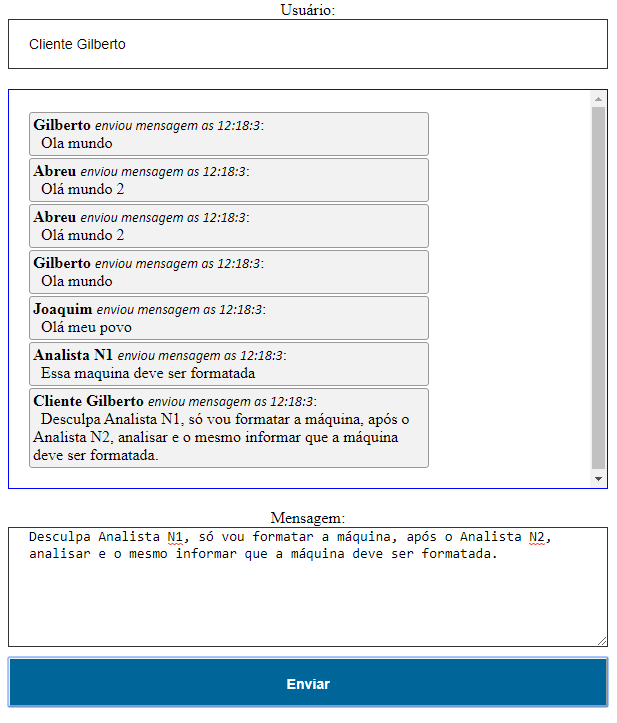

# **TRABALHO MATÉRIA SISTEMA DISTRIBUÍDO**

### O intuito do trabalho é fazer um chat de maneira que seja possível conexão de dois clientes. 

### **Problema passado pelo professor:**
Esses utilizarão o Web Service como intermediário do bate-papo. Do lado do cliente, deverão consumir dois métodos do serviço web, um para envio da mensagem para o cliente distinatário e partir do remetente e outro para verificar se há alguma mensagem enviada do clente destinatário para o remetente.

### **Requisitos para executar a aplicação**
* [Node.js](https://nodejs.org/en/) instalado
* [Npm](https://www.npmjs.com/get-npm) instalado
* Terminal para comandos

### **Ferramentas utilizadas nesta aplicação:**
* Node.js
* Socket.io.js
* Depedências
  * Nodemon
  * Express

### **Instruções para executar o chat**
Após baixar a pasta `chat_`, na pasta raiz da aplicação, caso esteja usando o [ **Visual Studio Code** ] abrir o terminal e executar o seguinte o comando abaixo para instalar os modulos necessário `npm install`. 

Após rodar o comando acima, no terminal do [ **Visual Studio Code** ] rodar o seguinte comando `nodemon server.js` ou `node server.js`

Após realizar este comando, abrir o navegador e entrar no endereço (`http://localhost:3300`).
